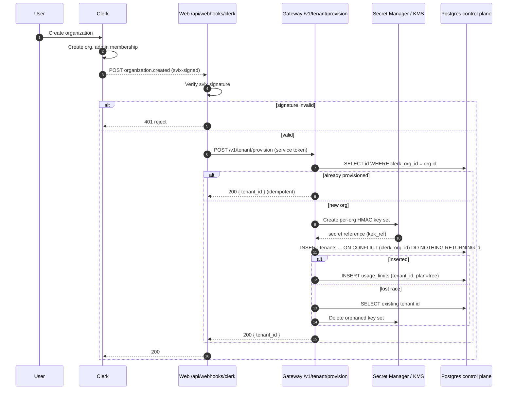

# Initiative 1: Organizations, users & access (Clerk)

Status: draft spec, build-ready. Owner: platform. Ticket: TODO (file the umbrella ticket in Linear before implementation).

This is a design spec. It defines the data model, endpoints, and file-level change
list. It does not contain the implementation.

## 1. Summary, goals, non-goals

### Summary

Today ai-tally is a single-tenant demo. The dashboard hardcodes one tenant
(`const TENANT = process.env.TALLY_TENANT_ID ?? "local-dev"`, repeated across at
least 18 files under `web/lib` and `web/app`), the gateway control-plane endpoints
trust an unauthenticated `x-tenant-id` header, and there is no login. This
initiative replaces that with real organizations, login, and access using
[Clerk](https://clerk.com) as the system of record for identity.

The outcome: a stranger can sign up, get an organization provisioned as an
ai-tally tenant, invite teammates with roles, hold real per-org ingest API keys,
and see only their own org's data. `local-dev` disappears from the product path
and survives only as an explicit local-development escape hatch.

This is the foundation the one-step connect and the Goose demo both build on.

### Goals

1. Sign-up and login for the dashboard via Clerk.
2. Organizations, memberships, roles, invitations, and org switching, all owned
   by Clerk.
3. Every new Clerk organization is provisioned as an ai-tally `tenants` row with
   its own per-org HMAC key set and its own ingest API keys.
4. The dashboard resolves the active Clerk org to a tenant UUID and scopes every
   read and every control-plane write to it. No `local-dev` on the product path.
5. Per-org ingest API keys: mint, list (metadata only), rotate, revoke, from the
   dashboard. Keys keep working in the `/v1/batches` hot path and the edge proxy
   with no Clerk round-trip.
6. Close the control-plane auth gap: the web server authenticates to the gateway,
   and Clerk org roles gate key and member management.
7. A single canonical `TenantId` (the tenant UUID) tags every span, so ingest,
   the edge proxy, seed, demo backfill, and the dashboard reads all agree.

### Non-goals

- No Postgres `users` or `memberships` tables. Clerk owns those (Decision 1).
- No Clerk involvement in the ingest path. Ingest auth stays in ai-tally's own
  control plane (Decision 2).
- No billing or plan-purchase flow. New orgs land on `plan = 'free'`; plan and
  billing source are an open question (§12).
- No custom roles beyond Clerk's default `admin` / `member` in P1. Finer roles
  and a true `owner` need Clerk custom roles, a paid tier (§9, §12).
- No migration of the existing `local-dev` demo data into a real org. Handling of
  the existing demo rows is an open question (§12).
- No data-residency routing on `region`. The column stays, defaulting as today.

### User flow

The end-to-end journey the mechanics in this spec produce.

**First user of a new org (self-serve).**

1. They hit the app and land on Clerk sign-up (email or social). Clerk creates the
   user identity; no ai-tally tenant exists yet.
2. Signed in but in no organization, so the app redirects them to a
   "Create your organization" screen (Clerk `<CreateOrganization>`). They name it.
3. Clerk creates the org, makes the creator an `admin`, and sets it as the active
   org on the session.
4. Behind the scenes, `organization.created` fires the provisioning webhook (§4):
   the web `/api/webhooks/clerk` route verifies svix and forwards to the gateway,
   which provisions the tenant (UUID, per-org HMAC key, free plan) mapped to the
   Clerk `orgId`, idempotently.
5. They land in the dashboard scoped to their org (`getTenant()` resolves `orgId`
   to the tenant UUID, §7). It is empty until they connect a source, which is
   Initiative 2.

**Inviting teammates (enabling more users).**

- An admin invites by email with a role from Clerk's `<OrganizationProfile>` (§7).
- The invitee signs up or signs in, accepts, and joins the existing org with that
  role. No new tenant is created; they share the org's tenant and data.
- Members get a read-only dashboard; admins can mint keys and manage members (§9).

**Returning user.**

- Sign in, Clerk restores the session and the active org, and the dashboard loads
  scoped to it. A user in multiple orgs switches with the `<OrganizationSwitcher>`
  (§7), which re-scopes every read and write.

**Signup access mode: open vs invite-only (decision).**

Enabling a user means a Clerk identity plus membership in an org that has a
provisioned tenant. Who is allowed to self-enable is a real product choice, and
Clerk supports both:

- **Open self-serve.** Anyone can sign up and create their own org (and tenant).
  Simplest funnel, but anyone with the link gets a tenant.
- **Invite-only / allowlist.** Clerk restricts sign-ups to invited emails or an
  allowlist, so you approve who gets a tenant.

Recommendation for the beta: start invite-only (allowlist the testers) and flip to
open self-serve later. It keeps the tester group controlled and avoids provisioning
tenants for unknown sign-ups while the product is still in beta. This is a Clerk
setting plus, optionally, gating the create-org step, not new ai-tally code (§12 Q6).

## 2. Decisions

1. **Clerk is the system of record for identity.** Users, organizations,
   memberships, roles, invitations, and org switching all live in Clerk.
   ai-tally does not create Postgres `users` or `memberships` tables. ai-tally
   stores only the org-to-tenant mapping (`tenants.clerk_org_id`), the per-org
   HMAC secret reference (`tenants.hash_salt_kek_ref`, already present), and the
   ingest API keys (`api_keys`, already present).
2. **ai-tally keeps ingest API keys in its own control plane, not Clerk.** The Go
   edge proxy (`infra/edge-proxy`) and the `/v1/batches` path verify keys in the
   hot path. `infra/gateway/src/gateway/auth.py::ApiKeyAuth.authenticate` hashes
   the presented token SHA-256 and looks up a non-revoked `api_keys` row. A Clerk
   round-trip per ingest request is not affordable, so keys stay local.
3. **Clerk owns auth for the dashboard only, never for ingest.** The dashboard
   uses Clerk sessions. Ingest continues to use `api_keys`.
4. **Canonical `TenantId` is the tenant UUID.** `db/clickhouse/otel_spans.sql`
   has `TenantId LowCardinality(String)` first in `ORDER BY`. Authenticated
   ingest already tags spans with the key's tenant UUID (`result.tenant_id` in
   `app.py`), but the demo backfill and the dashboard read filter use the tenant
   NAME `local-dev`. We standardize on the UUID everywhere and reconcile the
   seed, demo backfill, edge-proxy telemetry, and dashboard reads onto it (§8).
5. **Keys stay minted, hashed, and shown once.** A raw ingest token is returned
   exactly once at creation. Only its SHA-256 (`key_hash`) is stored. The UI
   shows a non-secret `token_prefix` thereafter.

## 3. Data model

New migration `db/postgres/0029_orgs_and_access.sql`. The next free number is
0029: existing files run `0001` through `0028`, with `0017` missing and a
duplicate `0005` (`0005_cac_periods.sql` and `0005_tenant_eval_config.sql`).

All new columns are additive and nullable so the existing `local-dev` tenant row
and its keys survive the migration untouched.

```sql
-- 0029_orgs_and_access.sql
-- Organizations, users & access (Initiative 1). Ticket: TODO (umbrella).
--
-- Clerk is the system of record for identity (users, orgs, memberships, roles,
-- invitations). ai-tally stores only the org-to-tenant mapping plus display-only
-- metadata on the ingest keys it already owns. No users/memberships tables here:
-- those live in Clerk by design.
--
-- All columns are ADDED nullable so the pre-existing `local-dev` tenant and its
-- keys survive unchanged. clerk_org_id is nullable for the same reason: the demo
-- tenant has no Clerk org, and a real org fills it in on provision.

-- Map a Clerk organization to an ai-tally tenant. Nullable: the local-dev demo
-- tenant has none. Partial UNIQUE index so at most one tenant maps to a given
-- Clerk org, while any number of tenants may have NULL (only local-dev should).
ALTER TABLE tenants
    ADD COLUMN IF NOT EXISTS clerk_org_id TEXT;

CREATE UNIQUE INDEX IF NOT EXISTS uq_tenants_clerk_org_id
    ON tenants (clerk_org_id)
    WHERE clerk_org_id IS NOT NULL;

-- Display-only metadata on ingest keys. The secret is STILL only ever stored as
-- key_hash (SHA-256). token_prefix is a non-secret leading slice for the UI so a
-- human can tell two keys apart in a list; it is not sufficient to authenticate.
-- created_by is the Clerk user id that minted the key (audit only). last_used_at
-- is a best-effort UI convenience, updated off the hot path (see §5).
ALTER TABLE api_keys
    ADD COLUMN IF NOT EXISTS name         TEXT,
    ADD COLUMN IF NOT EXISTS token_prefix TEXT,
    ADD COLUMN IF NOT EXISTS created_by   TEXT,          -- Clerk user id (user_...)
    ADD COLUMN IF NOT EXISTS last_used_at TIMESTAMPTZ;
```

Notes:

- `tenants.hash_salt_kek_ref` already exists with
  `CONSTRAINT no_raw_secret CHECK (hash_salt_kek_ref NOT LIKE 'sk-%' AND length(hash_salt_kek_ref) < 512)`.
  The provision flow (§4) must honor it: store only a Secret Manager / KMS
  reference, never raw key material.
- `api_keys` already has `key_hash TEXT NOT NULL UNIQUE` (SHA-256 of the token),
  `scope TEXT DEFAULT 'write' CHECK (scope IN ('read','write','admin'))`,
  `tenant_id UUID REFERENCES tenants(id) ON DELETE CASCADE`, `created_at`,
  `revoked_at`, and index `idx_api_keys_tenant`. This migration adds only
  display metadata; the secret handling is unchanged.

### docker-compose mount

Add the mount to `infra/docker-compose.yml` alongside the existing
`0001` .. `0028` Postgres init mounts, following the established pattern:

```yaml
      - ../db/postgres/0029_orgs_and_access.sql:/docker-entrypoint-initdb.d/0029_orgs_and_access.sql:ro
```

### Applying by hand against a running stack

`docker-entrypoint-initdb.d/*.sql` runs ONLY on a first boot against an empty
volume. A stack that is already up will never pick up 0029 from the mount alone.
To apply it to a running stack, run it by hand, for example from `infra/`:

```
make psql < ../db/postgres/0029_orgs_and_access.sql
```

Every statement is `IF NOT EXISTS`, so applying it more than once is safe.

## 4. Provisioning flow

A new Clerk organization becomes an ai-tally tenant via a Clerk webhook.

- Clerk emits `organization.created`, signed with an [svix](https://docs.svix.com)
  signature (`svix-id`, `svix-timestamp`, `svix-signature` headers).
- The webhook targets a thin Next.js route in the web app,
  `web/app/api/webhooks/clerk/route.ts`, NOT the gateway directly. The gateway is
  private in the hosted topology (only `web` is publicly exposed, see the deploy
  kit), so an external caller like Clerk cannot reach it. The web route verifies
  the svix signature, then forwards the verified event to the gateway's
  `POST /v1/tenant/provision` with the `GATEWAY_SERVICE_TOKEN` (§6). This keeps the
  gateway off the public internet and folds the webhook into the one public surface.

Steps in the web webhook route (`web/app/api/webhooks/clerk/route.ts`):

1. Verify the svix signature against the configured webhook signing secret. Reject
   with 401 on failure. Never trust the body before the signature verifies. This
   route is public (no Clerk session) but svix-authenticated (§7).
2. On a verified `organization.created`, POST the event to the gateway
   `POST /v1/tenant/provision` with the service token. Return the gateway's result
   to Clerk (200 on success) so Clerk's own retry/backoff applies on a 5xx.

Steps inside the gateway `POST /v1/tenant/provision` handler (service-token authed):

1. Fast path: `SELECT id FROM tenants WHERE clerk_org_id = %s`. If a tenant already
   maps to this org (webhook redelivery), return its UUID and stop. No new key
   material is minted and nothing is inserted.
2. On a miss, mint a per-org HMAC key set in Secret Manager (or KMS) and store ONLY
   its reference in `tenants.hash_salt_kek_ref` (see §4.1). The reference must
   satisfy the `no_raw_secret` CHECK (not `sk-%`, length < 512). This is the
   per-tenant key under which user and account ids are HMAC-SHA256'd; it must be
   distinct per tenant so a hash cannot be joined across tenants.
3. Insert race-safely, because two concurrent deliveries can both miss step 1:

   ```sql
   INSERT INTO tenants (name, region, plan, hash_salt_kek_ref, clerk_org_id)
   VALUES (%s, %s, 'free', %s, %s)
   ON CONFLICT (clerk_org_id) WHERE clerk_org_id IS NOT NULL
   DO NOTHING
   RETURNING id;
   ```

   The `ON CONFLICT` arbiter must repeat the partial index predicate
   (`WHERE clerk_org_id IS NOT NULL`) so Postgres infers `uq_tenants_clerk_org_id`.
4. If the INSERT returned a row, `INSERT INTO usage_limits (tenant_id, plan)` with
   `plan = 'free'` (references `plan_tiers`) and return the new UUID (200).
5. If the INSERT returned NO row, a concurrent delivery won the race:
   `SELECT id FROM tenants WHERE clerk_org_id = %s`, return that UUID, and clean up
   the HMAC key just minted in step 2 (it is now orphaned). Do not leave orphaned
   key material behind.

The gateway provision endpoint is authenticated by the service token like every
other control-plane endpoint (§6); the svix signature is verified once, at the
public web route.

### Sequence



### 4.1 Per-org HMAC key set

This is the riskiest new piece of infrastructure in the initiative, so it gets its
own contract rather than a single line. The per-org HMAC key set is the secret
under which user and account ids are HMAC-SHA256'd, one distinct set per tenant so
hashes cannot be joined across tenants. It already has a home: `tenants.hash_salt_kek_ref`,
a KMS / Secret Manager reference (never raw material), bounded by the `no_raw_secret`
CHECK.

Contract:

- **Production.** On provision, mint a new random key set (at least 256 bits from a
  CSPRNG), store it in Secret Manager (or a KMS-wrapped secret), and write ONLY the
  resource reference into `hash_salt_kek_ref`. The reference is opaque and must pass
  the CHECK (not `sk-%`, length < 512).
- **Versioning.** The key set is versioned so rotation does not orphan existing
  hashes (the SDK already emits a `*_hash_key_version` alongside each hash). A
  rotation adds a new active version; old versions stay resolvable for historical
  hashes. Rotation itself is out of P1 scope, but the reference format must leave
  room for a version selector.
- **Local / dev.** `make up` has no real KMS. Provisioning in dev generates the key
  set and stores it wherever the local `KeyMaterialProvider` reads from (the same
  place `HmacKeyRegistry.provision(...)` uses today for `local-dev`), with a local
  reference string that still satisfies the CHECK. No cloud dependency for local
  development.
- **Consumption / handoff to Initiative 2.** The SDK hashes client-side, so it must
  obtain the active key set. That is the ingest-key-authenticated
  `GET /v1/tenant/hmac-key` bootstrap specified in Initiative 2 (returns the active
  version only, treated as sensitive, cached in-process). Initiative 1 only has to
  guarantee the key set exists and is referenced; Initiative 2 defines how it is
  fetched. The two must agree on the reference format and the version field.

Provisioning must never store raw key material in Postgres, and must never log it.
A failure to mint the key set fails the provision (no tenant row without a usable
`hash_salt_kek_ref`), rather than creating a tenant that cannot hash.

## 5. Gateway endpoints

All new endpoints follow the existing store pattern
(`gateway/tenant_budgets.py`, `gateway/connectors/config_admin.py`): a store class
with methods that each call `resolve_tenant_uuid(cur, tenant_id)` from
`gateway/tenant_lookup.py` before touching a tenant-scoped table. New store module:
`gateway/tenant_api_keys.py` (keys) and provisioning logic in
`gateway/tenant_provisioning.py`.

### Extend the resolver

`gateway/tenant_lookup.py::resolve_tenant_uuid` today passes a UUID through and
otherwise looks up `SELECT id FROM tenants WHERE name = %s`. Extend it to also
match `clerk_org_id`, so a caller may pass a Clerk org id (`org_...`) and have it
resolve to the tenant UUID:

```python
# after the WHERE name = %s lookup fails, or folded into one query:
cur.execute(
    "SELECT id FROM tenants WHERE name = %s OR clerk_org_id = %s",
    (tenant_id, tenant_id),
)
```

Keep the UUID fast-path first (a `uuid.UUID(...)` parse) so the common case never
hits Postgres for parsing. Raise `TenantNotFoundError` unchanged when nothing
matches.

### Endpoints

| Method | Path | Purpose | Auth |
| --- | --- | --- | --- |
| POST | `/v1/tenant/provision` | Provision a tenant from a verified `organization.created` event. Called by the web webhook route after svix verify (§4). Returns `{ tenant_id }`. | service token (§6) |
| GET | `/v1/tenant/by-clerk-org/{org_id}` | Resolve a Clerk org id to `{ tenant_id, plan }`. The web app calls this once per session to map the active org to its UUID. | service token (§6) |
| GET | `/v1/tenant/keys` | List key metadata for the tenant. Never returns secrets. Returns `id, name, token_prefix, scope, created_by, created_at, last_used_at, revoked_at`. | service token |
| POST | `/v1/tenant/keys` | Mint a new ingest key. Returns the raw token exactly ONCE. | service token |
| POST | `/v1/tenant/keys/{id}/rotate` | Mint a replacement, revoke the old row. Returns the new raw token once. | service token |
| DELETE | `/v1/tenant/keys/{id}` | Revoke a key (sets `revoked_at = now()`). | service token |

Signatures and behavior:

- `GET /v1/tenant/by-clerk-org/{org_id}` -> `200 { "tenant_id": "<uuid>", "plan": "free" }`
  or `404` (`TenantNotFoundError`). Read-only, so the web layer can cache the
  mapping per org (§7).

- `POST /v1/tenant/keys` request `{ "name": "prod ingest", "scope": "write" }`.
  The handler:
  1. Resolves the tenant UUID.
  2. Generates a token `tally_sk_live_<random>` (a `tally_sk_live_` prefix plus
     a high-entropy random suffix; use a CSPRNG).
  3. Computes `token_prefix` as the non-secret leading slice, for example
     `tally_sk_live_` plus the first 6 characters of the suffix.
  4. Stores `key_hash = sha256(token)` (reuse `auth.py::hash_key` so ingest and
     minting agree byte-for-byte), plus `name`, `token_prefix`, `created_by`
     (the Clerk user id, passed by the web server), and `scope`.
  5. Returns `201 { "id", "token": "<raw token, once>", "token_prefix", "name", "scope" }`.
     The raw token is never persisted and never returned again.

- `POST /v1/tenant/keys/{id}/rotate`: within one transaction, insert a new key
  row (new token) and set `revoked_at = now()` on the old row. Returns the new
  raw token once. The old token stops authenticating immediately (ingest already
  filters `revoked_at IS NULL`).

- `DELETE /v1/tenant/keys/{id}`: `UPDATE api_keys SET revoked_at = now() WHERE id = %s AND tenant_id = %s`.
  A real revoke, not a delete, so an audit trail and `ON DELETE CASCADE` history
  survive. Returns `204`. Double-revoke is not an error.

- `last_used_at`: updated best-effort off the ingest hot path. Do NOT add a write
  to `ApiKeyAuth.authenticate` (it runs per request). Instead update it from an
  async, batched, or sampled path (for example a periodic job that reads recent
  ingest and stamps the key). It is a UI convenience; a stale or null value is
  honest and acceptable. Never fabricate a value.

The list endpoint must never return `key_hash` or any raw token. Only metadata.

## 6. Control-plane auth gap

Today the control-plane endpoints (`/v1/tenant/*` other than ingest) trust the
`x-tenant-id` header with no authentication. `app.py` reads
`request.headers.get("x-tenant-id", "")` and resolves it. Any caller who can
reach the gateway can read or write any tenant's config by naming it. This is
acceptable only because the deployment is single-tenant and local. With real
orgs it is a hole and closing it is part of this initiative.

Design:

- The web server (Next.js Route Handlers and server components) is the ONLY
  legitimate caller of the control-plane endpoints. It authenticates to the
  gateway with a server-only shared secret `GATEWAY_SERVICE_TOKEN`, sent as a
  bearer header (for example `Authorization: Bearer <token>`) on every
  control-plane call. The token lives only in the web server's server-side env,
  never in client bundles.
- The gateway rejects control-plane requests (except health) that lack a valid
  service token with `401`. This includes `/v1/tenant/provision`: the svix
  signature is verified once at the public web webhook route (§4), and the gateway
  endpoint behind it is authenticated by the service token like every other
  control-plane call. Behavior is gated by a new setting, defaulting on when
  `settings.require_api_key` is on, so local dev with auth off is unaffected (§10).
- The service token authenticates the WEB SERVER to the gateway. It does not
  identify the tenant. The web server still passes the resolved tenant (the UUID)
  in `x-tenant-id`, and is trusted to have already checked the Clerk session and
  org membership before doing so.
- Authorization (which human may do what) is enforced in the web server against
  the Clerk org role BEFORE any control-plane write. Key minting, key rotation,
  key revocation, and member management require `orgRole === 'org:admin'`. A
  `member` gets read-only dashboard access and cannot mint keys or manage
  members (§9).

This split (service token authenticates the transport, Clerk role authorizes the
action) keeps the gateway simple and hot-path-free while making the web server the
single policy enforcement point, which it already is for every control-plane
write today.

## 7. Dashboard changes

Add `@clerk/nextjs` to `web/`.

1. **Provider.** Wrap the root layout (`web/app/layout.tsx`) in `<ClerkProvider>`.
2. **Middleware.** Add `web/middleware.ts` using `clerkMiddleware()`. Protect all
   app routes. Public routes: sign-in, sign-up, and `POST /api/webhooks/clerk`
   (the Clerk provisioning webhook, which carries no Clerk session and is
   authenticated by its svix signature inside the route, §4). Everything else
   requires a session.
3. **Org requirement.** Require an active organization. When the Clerk session has
   no active org (`orgId` is null), redirect to a select-or-create-org screen.
   The product has no "personal workspace" concept; a user must be in an org to
   see data.
4. **Org switching.** Add Clerk's `<OrganizationSwitcher>` to the app chrome
   (header/nav), so a user in multiple orgs switches the active org, which
   re-scopes every read and write.
5. **`getTenant()` server helper.** Add `web/lib/getTenant.ts`. A server-only
   helper that:
   - Reads `{ orgId, orgRole }` from Clerk `auth()`.
   - Resolves `orgId` to a tenant UUID via
     `GET /v1/tenant/by-clerk-org/{orgId}` (service-token authenticated), and
     caches the mapping (per-org, in-process, with a short TTL) so it is not a
     per-request round-trip.
   - Returns `{ tenantId: <uuid>, orgId, orgRole }`.
   - Throws / redirects when there is no active org.
6. **Thread the tenant.** Replace every
   `const TENANT = process.env.TALLY_TENANT_ID ?? "local-dev"` with the resolved
   tenant from `getTenant()`, threaded from the request. Known occurrences (grep
   `TALLY_TENANT_ID`): `web/lib/clickhouse.ts`, `web/lib/budgets.ts`,
   `web/lib/accountLabels.ts`, `web/lib/revenueUpload.ts`,
   `web/lib/unitEconomicsConfig.ts`, `web/lib/costConnectors.ts`,
   `web/lib/tenantBudgetsClient.ts`, `web/lib/tenant.ts`,
   `web/lib/stripeConnector.ts`, `web/lib/cac.ts`, `web/lib/revenueSources.ts`,
   `web/lib/allocationConfig.ts`, `web/app/api/features/value-events/route.ts`,
   `web/app/api/guardrails/route.ts`, `web/app/api/revenue-uploads/template/route.ts`,
   `web/app/api/unit-economics/config/route.ts`. Re-grep before implementing; the
   set drifts. Each of these must take the tenant as a parameter or read it from
   `getTenant()` rather than from a module-level constant. The ClickHouse read
   filter (`WHERE TenantId = {tenant:String}`) must be fed the tenant UUID (§8).
7. **Key management UI.** A settings page: list keys (name, `token_prefix`,
   scope, created_by, created_at, last_used_at, revoked state), a create modal
   that shows the raw token exactly once with a copy button and a clear "you will
   not see this again" warning, a rotate action, and a revoke action. All write
   actions are admin-only and call the gateway via the service token.
8. **Member management.** Use Clerk's `<OrganizationProfile>` for invites,
   role changes, and removals. ai-tally does not build its own membership UI.

The web app continues to read ClickHouse directly for telemetry and to call the
gateway for control-plane writes. Neither path touches Postgres directly.

## 8. Ingest and edge proxy: canonical TenantId

Minted keys already work end to end: `POST /v1/batches` authenticates via
`ApiKeyAuth`, sets `batch.tenant_id = result.tenant_id` (the key's tenant is
authoritative), and refuses a body claiming a different tenant with
`TENANT_MISMATCH`. The edge proxy accepts `X-Tenant-Key` and meters in the
request path without touching bodies. No change is needed to make new keys
authenticate.

What must change is the tenant IDENTIFIER stamped on spans, so everything agrees.

Problem (verified): `db/clickhouse/otel_spans.sql` orders by `TenantId` first and
the dashboard filters `WHERE TenantId = {tenant:String}` with `tenant` defaulting
to the NAME `local-dev`. But authenticated ingest tags spans with the tenant UUID
(`result.tenant_id`). So the demo backfill (`make chatbot-demo-backfill`, seeded
by `make seed`) writes the name while real ingest writes the UUID, and a UUID-
scoped dashboard would not see name-tagged demo rows and vice versa.

Decision (Decision 4): canonical `TenantId = tenant UUID`. Required updates:

- **Ingest** (`app.py` `/v1/batches`): already stamps `result.tenant_id` (UUID).
  Confirm no path stamps the name. No change expected; add a test asserting the
  written `TenantId` is a UUID.
- **Edge-proxy telemetry** (`infra/edge-proxy`): ensure the `TenantId` it emits
  is the tenant UUID resolved from the `X-Tenant-Key`, not any name. If the proxy
  currently forwards a name, resolve to the UUID (the key already maps to a
  tenant UUID) before emitting telemetry.
- **Seed** (`infra/Makefile` `seed`: "Create a local tenant + API key + feature
  tags in Postgres"): make the seed capture the created tenant UUID and expose it
  (for example write it where the backfill and `TALLY_TENANT_ID` can read it), so
  the demo tenant is addressed by UUID, not by the name `local-dev`.
- **Demo backfill** (`make chatbot-demo-backfill`): tag generated spans with the
  seeded tenant UUID rather than the literal `local-dev`.
- **Dashboard reads**: `getTenant()` supplies the UUID, and the ClickHouse filter
  binds the UUID (§7).

### Compatibility note for existing local demo data

Any spans already written to a developer's local ClickHouse under
`TenantId = 'local-dev'` (the name) will not match a UUID-scoped read after this
change. This is a local-only data concern (production ingest already used the
UUID). Two acceptable paths, to be chosen at implementation time: re-run
`make seed` + `make chatbot-demo-backfill` against a fresh volume so the demo
data is written under the UUID, or, if a developer wants to keep existing rows,
run a one-off ClickHouse `ALTER TABLE otel_spans UPDATE TenantId = '<uuid>'
WHERE TenantId = 'local-dev'` mutation locally. The clean path (re-seed) is
recommended; the reconciliation of the shared `local-dev` demo data is an open
question (§12).

## 9. Roles and permissions

Clerk's default org roles are `admin` (`org:admin`) and `member`
(`org:member`). Mapping to ai-tally capabilities:

| Capability | admin | member |
| --- | --- | --- |
| View dashboard (all telemetry, cost, value) | Yes | Yes |
| Switch active org | Yes (own orgs) | Yes (own orgs) |
| View ingest keys (metadata only) | Yes | Yes |
| Mint / rotate / revoke ingest keys | Yes | No |
| Manage members (invite, role, remove) | Yes | No |
| Edit control-plane config (budgets, guardrails, connectors, allocation, etc.) | Yes | No (read-only) |

Enforcement is in the web server against `orgRole` from Clerk `auth()` before any
control-plane write (§6). The gateway does not see the human role; it sees the
service token and the resolved tenant.

Note: Clerk's default tier ships only `admin` and `member`. A true `owner` role,
or finer-grained roles (for example a billing-only role, or read-only vs.
config-editor split among non-admins), requires Clerk custom roles, which are a
paid-tier feature. Out of scope for P1; tracked as an open question (§12).

## 10. Local-dev escape hatch

`make up` must still bring up a working stack with no Clerk account and no Clerk
keys. Requirements:

- A dev-only environment flag, for example `TALLY_DEV_TENANT` (a tenant UUID or
  the name `local-dev`). When set, `getTenant()` short-circuits: it skips Clerk
  entirely and returns the pinned dev tenant, so the dashboard renders without a
  login.
- Clerk middleware is a no-op (or not mounted) when the flag is set, so app
  routes are reachable without a session.
- The gateway service-token check (§6) is gated on `settings.require_api_key`
  (already the local "auth off" switch). With auth off, control-plane calls do
  not require the service token, matching today's local behavior.
- The `TALLY_TENANT_ID ?? "local-dev"` default is removed from the product code
  paths; the ONLY place the `local-dev` fallback survives is behind the explicit
  dev flag. A production build with the flag unset and no active Clerk org must
  refuse to serve tenant data rather than silently falling back to `local-dev`.

This keeps `make up` and CI unblocked on a Clerk account while ensuring
`local-dev` cannot leak onto the product path by default.

## 11. Invariants respected

Cross-checked against the CLAUDE.md invariants:

- **Keys hashed, shown once.** Only `key_hash` (SHA-256) is stored. The raw token
  is returned exactly once at mint/rotate and never again. `token_prefix` is a
  non-secret display slice, not sufficient to authenticate.
- **HMAC reference, not raw secret.** The per-org HMAC key set is stored only as a
  Secret Manager / KMS reference in `tenants.hash_salt_kek_ref`, honoring the
  existing `no_raw_secret` CHECK (not `sk-%`, length < 512).
- **Per-tenant HMAC unbroken.** Each org gets its own distinct HMAC key set at
  provision, so user and account hashes cannot be joined across tenants. Canonical
  `TenantId = UUID` does not change the hashing; it only fixes which tenant string
  labels a span.
- **No bodies in telemetry.** Unchanged. This initiative touches identity and
  key metadata only. No prompt, completion, or retrieved text is added anywhere.
- **Money is integer micro-USD.** Unchanged. No money math is added.
- **Control-plane writes only via the gateway.** All new writes (provision, keys)
  go through gateway endpoints. The web app never touches Postgres directly; it
  calls the gateway with the service token and reads ClickHouse for telemetry.
- **Honest under uncertainty.** `last_used_at` is null until known and never
  guessed. A missing org resolution is a 404, not a silent `local-dev`.

## 12. Open questions

1. **Clerk custom roles / paid tier.** A true `owner` role and finer-grained
   non-admin roles need Clerk custom roles (paid). Do we ship P1 on the free
   `admin`/`member` split and upgrade later, or start on the paid tier?
2. **`organization.deleted` handling.** When a Clerk org is deleted, what happens
   to the tenant and its data? Options: soft-disable the tenant (revoke keys,
   block reads) and retain data for a grace period, or hard-delete. Needs a
   webhook handler either way. Not in P1 scope but must be decided before GA.
3. **Data residency / `region`.** `tenants.region` exists and defaults today. Do
   we let an org choose a region at creation, and does Clerk's org metadata carry
   it? Out of scope for P1.
4. **Plan / billing source.** New orgs land on `plan = 'free'`. Where does a plan
   change come from (a billing provider webhook, a manual admin action, Clerk org
   metadata)? Undefined here.
5. **Existing `local-dev` demo data.** How do we reconcile the shared demo data
   currently tagged `local-dev` (name) once canonical `TenantId` is the UUID? The
   recommended path is re-seed (§8), but a shared demo environment may want an
   in-place mutation instead.
6. **Signup access mode.** Open self-serve vs invite-only for the beta (see §1,
   "User flow"). Recommendation: invite-only for the beta, open later. This is a
   Clerk setting, not ai-tally code.

## 13. Phasing

Mapped to the roadmap's P1 / P2 / P3.

### P1: Clerk auth, orgs, `getTenant`, dev escape hatch

Scope: add `@clerk/nextjs`, `ClerkProvider`, `middleware.ts`,
`OrganizationSwitcher`, the require-active-org redirect, the `getTenant()` helper
(resolving via the by-clerk-org endpoint, or the dev flag when set), and the
`TALLY_DEV_TENANT` escape hatch. Replace the `TALLY_TENANT_ID ?? "local-dev"`
constants with the threaded tenant.

Done when: a user can sign up, create or select an org, and see the dashboard;
`make up` still works with no Clerk account via the dev flag; no product code path
falls back to `local-dev` unless the dev flag is set; `web` typecheck, lint, and
vitest pass (introducing no new failures beyond the two known ClickHouse-
reachability cases).

### P2: migration 0029, provisioning webhook, resolver, canonical TenantId, service-token auth

Scope: ship `0029_orgs_and_access.sql` with its compose mount; the web
`/api/webhooks/clerk` route (svix verify) forwarding to the service-token-authed
`POST /v1/tenant/provision` with race-safe upsert and per-org HMAC minting;
`GET /v1/tenant/by-clerk-org/{org_id}`; extend `resolve_tenant_uuid` to match
`clerk_org_id`; standardize canonical `TenantId = UUID` across ingest, edge-proxy
telemetry, seed, and demo backfill; and the `GATEWAY_SERVICE_TOKEN` control-plane
auth gate.

Done when: creating a Clerk org provisions a tenant (idempotently) with a per-org
HMAC ref honoring the CHECK; the dashboard resolves an org to its UUID and reads
only that org's spans; unauthenticated control-plane calls are rejected when auth
is on; seed + demo backfill write UUID-tagged spans; gateway `pytest` and `ruff`
pass; edge-proxy `go build` / `go test` / `gofmt` clean.

### P3: keys CRUD, dashboard key UI, member management

Scope: the keys endpoints (`GET/POST /v1/tenant/keys`,
`POST /v1/tenant/keys/{id}/rotate`, `DELETE /v1/tenant/keys/{id}`) with the
`gateway/tenant_api_keys.py` store; the dashboard key-management UI
(list, create-with-one-time-token modal, rotate, revoke); admin-role gating on
all key writes; and member management via Clerk `OrganizationProfile`.

Done when: an admin can mint a `tally_sk_live_...` key, see it once, use it to
ingest against `/v1/batches` and the edge proxy, rotate it, and revoke it; a
member sees keys read-only and cannot mint or manage members; the list never
exposes a secret; all four projects' checks pass.
