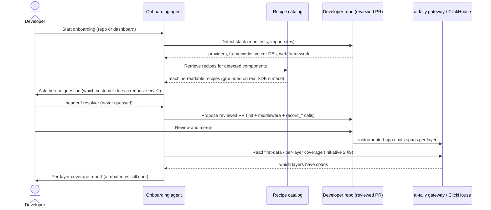

# Initiative: Onboarding agent

Status: draft spec, build-ready. Owner: platform. Ticket: TODO (file the umbrella ticket in Linear before implementation).

This is a design spec. It defines the decisions, the delivery forms, the recipe
schema, the tool / endpoint shapes, and the file-level change list. It does not
contain the implementation.

Depends on Initiative 1 (Organizations, users & access, see
`docs/specs/initiative-1-orgs-and-access.md`) and Initiative 2 (Real one-step
connect, see `docs/specs/initiative-2-one-step-connect.md`). This spec reuses
their decisions verbatim and does not re-litigate them: Clerk owns dashboard
identity; ai-tally owns per-org ingest API keys in its own control plane (the
`api_keys` table, SHA-256 hashed, minted as `tally_sk_live_...`, shown once);
canonical `TenantId = UUID`.

It builds directly on Initiative 2 §4.6 ("Coverage: what is automatic, what needs
app code") and its three "Automating the app-side layers" levers. This initiative
is the agent that applies those levers inside a developer's own codebase.

## 1. Summary, goals, non-goals

### Summary

Initiative 2 makes the LLM layer one line: a base-URL swap, or `tally.init(key)`,
captures model, tokens, and cost for the patched `openai` / `anthropic` clients.
But Initiative 2 §4.6 is explicit that the one-liner is a ramp, not a switch. The
other things ai-tally meters do not light up on their own:

- **The non-LLM cost layers.** Vector search (`record_vector_call`), the app's own
  tool calls (`record_tool_call`), and embeddings not made through the patched
  client (`record_embedding_call`) are explicit SDK records
  (`sdk/python/src/tally/client.py`).
- **The attribution dimensions.** Cost per customer needs `with_account("acct_...")`
  once at request start; cost per feature needs `start_trace(feature_tag=...)`;
  per-agent needs the agent tag (`sdk/python/src/tally/context.py`).
- **The value side.** Conversions and revenue events arrive through connectors.

Wiring those means editing real call sites in a real codebase: knowing which
`pinecone` / `weaviate` call is a vector search, which function is a billable tool,
and, above all, how the app knows which customer a request belongs to. That last
question is the irreducible floor: only the app knows it, and the agent must never
guess it (§6).

This initiative is an AI onboarding agent that does that wiring. It reads the
developer's codebase, detects the stack, asks the one question it must never guess,
and proposes a **reviewed change, never a silent edit**, that wires `tally.init()`,
drop-in account / feature middleware bound to the developer's answer, and the
layer-specific `record_*` calls at the real call sites. Then it **verifies** by
watching Initiative 2 §9's first-data / coverage signal and reports which layers
are attributed and which are still unattributed.

The agent never hand-writes the SDK API from memory. It retrieves a maintained,
machine-readable **instrumentation recipe** per framework / provider (§5) and
adapts it, grounded on the recipe catalog plus the real SDK surface. That is what
keeps it from hallucinating method names that do not exist.

Success: a developer who has done the Initiative 2 one-liner and sees only LLM
cost can, in one guided session, land a reviewed PR that lights up their tool,
vector, embedding, and per-customer / per-feature layers, and see the coverage
report confirm each layer is now flowing.

### Goals

1. Detect the developer's stack from their repo: LLM providers, agent frameworks
   (LangChain, the Agents SDK, MCP clients), vector DBs, and the web framework.
2. Ask the one irreducible question ("how does your app know which customer a
   request belongs to?") rather than guessing it, and bind the account / feature
   middleware to that answer (§6).
3. Propose a reviewed PR, never a silent edit, that wires `tally.init()`, the
   middleware, and `record_tool_call` / `record_vector_call` /
   `record_embedding_call` at the real call sites.
4. Ground every proposed edit on a maintained recipe (§5) plus the real SDK
   surface, so the agent adapts a known-good recipe rather than inventing an API.
5. Verify: after the change merges and runs, report per-layer coverage (LLM,
   tools, vector, embeddings, account attribution) from the Initiative 2 §9
   signal, honestly, rather than claiming success blindly (§7).
6. Ship in three delivery forms ordered by trust barrier (§4), lowest first, so a
   developer who will not grant repo access still gets value.

### Non-goals

- **Rebuilding Initiative 2.** `tally.init`, the auto-instrumentation seam, the
  first-data probe, and the coverage boundary are delivered there. This initiative
  consumes them and automates the "needs app code" remainder (§8).
- **Extending the SDK's public API.** The agent wires existing methods
  (`record_tool_call`, `record_vector_call`, `record_embedding_call`,
  `with_account`, `start_trace`). New SDK auto-instrumentation for frameworks is
  Initiative 2 §4.6 lever 1 territory, tracked separately; where a maintained
  auto-instrumentor exists the agent prefers wiring it over hand-placing records.
- **Guessing account identity.** The agent never invents a customer resolver. If
  the developer cannot answer the account question, the account layer stays
  unattributed and the agent says so (§6).
- **Silent or unreviewed edits.** Every code change is a diff a human reviews and
  merges. No delivery form writes to a branch the developer has not opted into.
- **Exfiltrating source or secrets.** No delivery form sends repo contents or
  secrets to ai-tally beyond what a reviewed PR contains; the MCP form (§4.2)
  keeps source on the developer's machine entirely (§9 security posture).
- **Non-Python SDK wiring in P1.** The SDK is Python (`sdk/python/`); the recipe
  catalog is structured to hold other-language recipes later, but P1 ships Python
  recipes only. The proxy base-URL swap is already language-agnostic (Initiative 2
  §6) and needs no agent.

## 2. Decisions

1. **Reviewed PR, never a silent edit.** Every code change the agent makes is a
   diff a human reads and merges. This is the product's honesty invariant applied
   to the developer's own code: the agent proposes, the developer disposes.

2. **The agent retrieves a recipe; it does not hand-write the SDK API.** For each
   detected framework / provider it fetches a maintained, machine-readable recipe
   (§5) and adapts it to the concrete call site. The recipe catalog plus the real
   SDK surface (`sdk/python/src/tally/`) is the grounding. An unrecognized stack
   with no recipe yields a reported gap, not a hallucinated `record_*` call.

3. **The account question is asked, never inferred.** Only the app knows which
   customer a request serves (§6). The agent asks for one header or one resolver
   and binds the middleware to it. It never picks a field on its own and calls it
   the customer id.

4. **Three delivery forms, built lowest-trust-barrier first.** Dashboard Q&A
   snippets (no repo access), then an ai-tally MCP server (the developer's own
   coding agent calls it, source never leaves their machine), then a hosted repo
   PR bot (scans and opens PRs directly). Recommended build order matches that
   trust order (§4, §10).

5. **The agent consumes Initiative 2, it does not fork it.** It wires
   `tally.init` (Initiative 2 §3), reuses the coverage boundary (Initiative 2
   §4.6), and reads the first-data / coverage signal (Initiative 2 §9) as its
   proof of success. It adds no parallel ingest or pricing path.

6. **Verification is honest per-layer coverage, not a green check.** The agent
   reports which layers are flowing and which are still dark, reading the real
   telemetry existence signal per layer (§7). It never reports a layer as covered
   without a span to prove it, mirroring "honest under uncertainty".

## 3. End-to-end flow

The agent's loop, whichever delivery form runs it (§4):

1. **Detect the stack.** Read dependency manifests (`requirements.txt`,
   `pyproject.toml`, `poetry.lock`) and import sites to identify LLM providers
   (`openai`, `anthropic`), agent frameworks (LangChain, the Agents SDK, MCP
   clients), vector DBs (`pinecone`, `weaviate`, `qdrant`, `chromadb`, `pgvector`),
   embedding call sites, and the web framework (FastAPI, Flask, Django).
2. **Retrieve recipes.** For each detected component, fetch the matching recipe
   from the catalog (§5). No match is recorded as a gap, not filled by guessing.
3. **Ask the one question.** Present the account-identity question (§6) with the
   candidate resolvers the detection surfaced (an auth dependency, a header, a
   tenant column) as options to confirm, never as an answer to assume.
4. **Propose a reviewed change.** Assemble a diff: `tally.init()` at startup,
   drop-in account / feature middleware bound to the answer, and `record_tool_call`
   / `record_vector_call` / `record_embedding_call` at the real call sites, each
   adapted from its recipe. The developer reviews and merges.
5. **Verify.** After the change runs, read the Initiative 2 §9 first-data signal
   per layer and report per-layer coverage (§7): LLM, tools, vector, embeddings,
   account attribution, each flowing or still dark.



## 4. Three delivery forms

Ordered by trust barrier, lowest first. Build order follows the same order (§10).

### 4.1 Dashboard Q&A to tailored snippets (lowest barrier, no repo access)

The dynamic version of Initiative 2 §9's snippet generator. The developer answers
a few questions in the dashboard (which providers, which vector DB, which web
framework, how a request carries the customer id) and the dashboard renders
copy-paste snippets tailored to those answers: the `tally.init()` line, the
middleware for their framework bound to their header, and `record_*` call templates
for their vector DB / tool sites. No repo access, nothing to install beyond the
SDK. The recipes that back the snippets are the same catalog entries the other two
forms use (§5), so the guidance is consistent across all three.

This extends Initiative 2 §9's static per-path snippet into a per-stack, per-answer
snippet. It is the fallback for a developer who will not connect a repo or run an
MCP server, and it is the cheapest to ship because it reuses the existing key-time
snippet surface.

### 4.2 ai-tally MCP server (recommended first real build)

An MCP server ai-tally publishes, that the developer's own coding agent (Claude
Code, Cursor) connects to. The developer's agent has their source; the ai-tally
MCP server does not. It exposes tools that return recipes and generated code, and
the developer's agent applies them locally and opens the PR. Source never leaves
the developer's machine, which is the lowest real-integration trust barrier and
dogfoods the product (ai-tally shipping an MCP server is itself a metered tool
surface).

Proposed MCP tools (shapes, not implementation):

| Tool | Input | Returns |
| --- | --- | --- |
| `detect_stack` | dependency manifest contents, optional import-site excerpts | detected providers, frameworks, vector DBs, web framework, and the recipe ids that match |
| `get_recipe` | recipe id (or framework / provider name) | the machine-readable recipe (§5): imports, edit points, code template, verification layer |
| `generate_middleware` | web framework, the account header / resolver answer (§6), optional feature-tag source | drop-in middleware source that sets account + feature for the request scope via `with_account` / `start_trace` |
| `instrument_call_site` | a call-site excerpt + its recipe id | the adapted `record_tool_call` / `record_vector_call` / `record_embedding_call` edit for that exact site |
| `explain_layer` | a layer name or a call-site excerpt ("what records this vector call?") | which `record_*` method covers it and why, grounded on the SDK surface |
| `coverage_report` | tenant key (or a dashboard-issued read token) | per-layer coverage from the Initiative 2 §9 signal (§7) |

The MCP server holds the recipe catalog and the SDK-surface grounding. It receives
only what the developer's agent chooses to pass (a manifest, a call-site excerpt),
never the whole repo, and it returns code and recipes, never edits anything itself.
Whatever the developer's agent produces still lands as a reviewed diff in their own
tooling.

### 4.3 Hosted repo PR bot (most powerful, highest trust ask; fast-follow)

A GitHub app (or a Claude Agent SDK headless bot) that, granted scoped repo access,
clones or reads the repo, runs the same detect -> retrieve -> ask -> propose loop
(§3), and opens a PR directly. Most powerful because it needs no developer coding
agent and can scan the whole tree; highest trust ask because it reads source
server-side. Gated behind explicit, scoped, revocable repo permission, reviewed
PRs only, never a direct push to a default branch, and the security posture in §9.
It is the fast-follow after the MCP server proves the recipes and the flow.

## 5. Recipe catalog design

The reliability mechanism. One machine-readable recipe per framework / provider,
maintained in-tree, so the agent retrieves and adapts a known-good recipe rather
than hallucinating the SDK API. The recipes encode the same content as Initiative
2 §4.6's three levers: patch the frameworks (tool / vector / embedding spans),
ingest OTel the app already emits, and config-not-code middleware for attribution.

### 5.1 Where it lives

A new in-tree directory, `sdk/python/recipes/` (data, not code), one file per
recipe, plus an index. Keeping it beside the SDK means a recipe and the SDK method
it targets move together: a change to `record_vector_call`'s signature is a diff
that touches the recipe in the same tree, so recipes do not silently drift from the
API. The catalog is the single source of truth all three delivery forms read.

### 5.2 Recipe schema

Each recipe is a structured document (YAML or JSON), validated against a schema so
a malformed or stale recipe fails loudly rather than producing a bad edit:

```yaml
id: vector.pinecone.query          # stable id, dotted namespace
kind: vector | tool | embedding | llm | middleware | otel
title: "Pinecone index.query -> record_vector_call"
detect:                            # how the agent knows this recipe applies
  imports: ["pinecone"]
  call_patterns: ["*.query(", "*.upsert("]
sdk_surface:                       # the exact SDK method this recipe wires
  method: "tally.client.TallyClient.record_vector_call"
  required_args: [provider, index, operation]
  layer: vector                    # gateway cost-layer bucket this lands in
edit:
  imports_to_add: ["import tally"]
  template: |
    # after the pinecone query returns
    tally.record_vector_call(
        provider="pinecone",
        index={index_name},
        operation="query",
        record_count={n_results},
    )
  placement: after_call            # where relative to the detected call
verify:
  layer: vector                    # the coverage layer that must light up (§7)
  operation_name: "vector"         # gen_ai.operation.name the gateway buckets on
notes: "record_count is API-symmetry only today; cost resolves from the catalog."
```

Key fields:

- **`detect`** grounds stack detection (§3 step 1): the imports and call patterns
  that mean this recipe applies.
- **`sdk_surface`** pins the recipe to a real method (`record_tool_call`,
  `record_vector_call`, `record_embedding_call`, `with_account`, `start_trace`).
  A validation step checks that `method` and `required_args` exist in the current
  SDK, so a recipe cannot reference an API that is not there. This is the concrete
  anti-hallucination guard.
- **`edit`** is the adaptable template: imports to add, the code template with
  named holes the agent fills from the call site, and placement.
- **`verify`** names the coverage layer and the `gen_ai.operation.name` the gateway
  buckets on (`tool`, `vector`, `embeddings`, and the LLM operation), which the
  verification loop (§7) reads back.

### 5.3 Grounding on the real SDK surface

The recipes' `sdk_surface` entries reference the real methods, verified against the
code in this repo:

- `record_tool_call(*, provider, tool, cost_micro_usd=None, ...)`, buckets on
  `gen_ai.operation.name == 'tool'` (`sdk/python/src/tally/client.py`).
- `record_vector_call(*, provider, index, operation, cost_micro_usd=None, ...)`,
  buckets on `gen_ai.operation.name == 'vector'`, tool-name slot encodes
  `{provider}.{index}.{operation}` (`sdk/python/src/tally/client.py`).
- `record_embedding_call(*, provider, model, input_tokens, ...)`, buckets on
  `gen_ai.operation.name == 'embeddings'` (`sdk/python/src/tally/client.py`).
- `record_llm_call(*, provider, model, usage, ...)` for call sites not covered by
  Initiative 2 auto-instrumentation (`sdk/python/src/tally/client.py`).
- `context.with_account(account_id, *, label=None)` and
  `context.start_trace(*, feature_tag=None, session_id=None, account_id=None, ...)`
  for the middleware recipes (`sdk/python/src/tally/context.py`).
- The instrumentation seam `ProviderInstrumentor` / `wrap_create` / `build_span`
  (`sdk/python/src/tally/instrumentation/base.py`), which framework
  auto-instrumentor recipes (Initiative 2 §4.6 lever 1) build on rather than
  hand-placing records.
- For lever 2 (ingest OTel the app already emits), the recipe points at the
  gateway's existing OTLP endpoint (`ingest_otlp_traces`,
  `infra/gateway/src/gateway/app.py`) so a team already emitting `gen_ai.*` spans
  needs no ai-tally-specific code.

## 6. The account-identity floor

Stated as plainly as Initiative 2 §4.6 states it: the irreducible floor is account
identity. Only the app knows which customer a request serves, so the agent must ask
for one header or one resolver and can never invent it. Everything else the agent
touches (which call is a vector search, which function is a tool) it can infer from
the code with a recipe; the customer id it cannot.

- **The one question.** "How does your app know which customer a request belongs
  to?" The agent surfaces the candidates its detection found (a FastAPI auth
  dependency, an `X-Customer-Id` header, a `tenant_id` column on the request user)
  and asks the developer to confirm which one, or to name another. It presents
  options; it does not choose.
- **What it wires.** The answer becomes the argument to the drop-in middleware
  recipe: the middleware resolves the customer once per request and wraps the
  handler in `with_account("acct_...")` (and `start_trace(feature_tag=...)` for the
  feature dimension), propagated via contextvars, so every span in the request
  scope carries the HMAC'd account hash (`sdk/python/src/tally/context.py`). The
  raw id is hashed in-process under the tenant key and never travels raw
  (Initiative 2 §7).
- **Honest when unanswered.** If the developer cannot or will not answer, the agent
  does not fabricate a resolver. It wires everything else, leaves the account layer
  unattributed (the `UNATTRIBUTED` sentinel,
  `sdk/python/src/tally/account_identity.py`), and reports the account layer as
  still dark in the coverage report (§7). A blank account, never a guessed one,
  mirrors the CLAUDE.md honesty invariant.

## 7. Verification loop

The agent's proof that instrumentation actually fired, reusing Initiative 2 §9's
first-data / coverage check rather than a fresh mechanism.

- **The signal.** Initiative 2 §9 defines a ClickHouse existence probe scoped to
  the tenant UUID (`SELECT 1 FROM otel_spans WHERE TenantId = {tenant:String}
  LIMIT 1`). This initiative extends the same probe per layer, keying on the
  `gen_ai.operation.name` the gateway buckets on, so each recipe's `verify.layer`
  (§5.2) maps to one existence check:

  | Layer | Existence signal |
  | --- | --- |
  | LLM | a span with the LLM operation for the tenant |
  | tools | a span with `gen_ai.operation.name == 'tool'` |
  | vector | a span with `gen_ai.operation.name == 'vector'` |
  | embeddings | a span with `gen_ai.operation.name == 'embeddings'` |
  | account attribution | a span carrying a non-empty `AccountIdHash` |

- **Per-layer report, honest.** After the reviewed change runs, the agent reads
  each layer's signal and reports flowing vs. still dark. It never marks a layer
  covered without a span to prove it. A layer the recipe wired but that has not yet
  emitted (the app path was not exercised) is reported as "wired, awaiting first
  event", not as covered. This is the honesty invariant applied to the agent's own
  success claim: the coverage report shows the real state, not an assumed one.

- **Closing the loop.** Layers still dark drive the next iteration: the agent
  points at the call sites it wired that have not fired (a code path not yet
  exercised) and the layers it could not wire (no recipe, or the account question
  unanswered), so the developer knows exactly what remains rather than being told
  "done".

## 8. Depends on (handoffs from Initiatives 1 and 2)

1. **Per-org ingest keys and canonical `TenantId = UUID`** (Initiative 1 §5, §8).
   The coverage probe (§7) scopes to the tenant UUID; the snippets the agent
   generates inline the org's real `tally_sk_live_` key exactly as Initiative 2 §9
   does.
2. **`tally.init` and the auto-instrumentation seam** (Initiative 2 §3, §4). The
   agent wires `tally.init()` and, where a framework auto-instrumentor exists,
   prefers it over hand-placed records. It adds no parallel init path.
3. **The coverage boundary** (Initiative 2 §4.6). This initiative is the agent that
   applies §4.6's three levers (patch frameworks, ingest OTel, config-not-code
   middleware) inside the developer's codebase. The "needs app code" list in §4.6
   is exactly this agent's work list.
4. **The first-data / coverage signal** (Initiative 2 §9). The verification loop
   (§7) extends that probe per layer; it does not invent a new telemetry read.
5. **The SDK surface** (`sdk/python/src/tally/client.py`, `context.py`,
   `instrumentation/base.py`). The recipe catalog's `sdk_surface` fields (§5.2)
   pin to these methods and are validated against them.

If Initiatives 1 and 2 have not landed, this initiative has nothing to wire: no
real keys, no `tally.init`, no coverage signal. That is the dependency, stated
plainly.

## 9. Invariants and security posture

Cross-checked against CLAUDE.md.

Invariants respected:

- **Honest under uncertainty.** The coverage report shows real per-layer state,
  never an assumed success (§7). An unanswered account question yields an
  unattributed layer, never a guessed customer id (§6). A stack with no recipe is a
  reported gap, never a hallucinated `record_*` call (§2 Decision 2).
- **No bodies in telemetry.** The agent wires only counts / hashes / mapped events
  through the existing `record_*` methods; it introduces no prompt or completion
  capture. The recipes carry no body-logging edit.
- **Identifiers by hash, credentials by reference.** The middleware the agent wires
  hashes the raw customer id in-process under the tenant key (Initiative 2 §7); the
  raw id never leaves the process. The agent never writes a raw customer id or a
  provider key into a span or a snippet.
- **Money is integer micro-USD.** The agent wires existing `record_*` methods,
  which already compute integer micro-USD via the catalog. It introduces no float
  dollars and no new pricing path.

Security posture (the delivery forms in §4 handle source and secrets):

- **Reviewed PRs only.** Every code change is a diff a human merges (§2 Decision 1).
  No form pushes to a default branch or edits without review.
- **Scoped, revocable repo access.** The hosted PR bot (§4.3) reads source only
  under explicit, scoped, revocable permission, and only to the extent a reviewed
  PR requires. The MCP form (§4.2) keeps source on the developer's machine
  entirely, receiving only the excerpts their own agent passes.
- **Never exfiltrate secrets or source.** No form sends repo contents or secrets to
  ai-tally beyond what a reviewed PR itself contains. Repo contents are treated as
  sensitive: not logged, not retained beyond the session, not used to train.
- **The agent never handles credentials.** It wires the org's ingest key into a
  snippet the developer copies (as Initiative 2 §9 already does); it does not read,
  store, or transmit provider API keys, which ride in-flight only through the proxy
  (Initiative 2 §11).

## 10. How it is built

- **The recipe catalog is the source of truth** (§5), maintained in-tree beside the
  SDK so recipes and the API they target move together. All three delivery forms
  read it.
- **The MCP server** (§4.2) is a thin server over the catalog and the SDK-surface
  grounding, exposing the tools in §4.2. Built with the MCP server tooling; it holds
  no repo, only recipes and generated code.
- **The hosted PR bot** (§4.3) is a Claude Agent SDK headless bot (or a GitHub
  app), running the detect -> retrieve -> ask -> propose loop server-side and
  opening reviewed PRs, gated behind the §9 security posture.
- **The dashboard Q&A form** (§4.1) is a web surface over the same catalog,
  extending Initiative 2 §9's key-time snippet generator.

## 11. Open questions

1. **Recipe format and validation.** YAML vs. JSON for the recipe files, and where
   the `sdk_surface` validation runs (a CI check in `sdk/python/` that every
   recipe's `method` / `required_args` exist in the current SDK). CI is the natural
   home; confirm.
2. **Detection depth for the MCP form.** How much the developer's agent passes to
   `detect_stack`: manifests only (cheap, misses dynamic call sites) vs. import-site
   excerpts (better detection, more source shared). Default to manifests, opt in to
   excerpts?
3. **Coverage read auth for the MCP `coverage_report` tool.** Whether it takes the
   tenant ingest key directly or a narrower dashboard-issued read token scoped to
   the existence probe. A read-scoped token is safer; does Initiative 1's key
   scoping cover it?
4. **Framework auto-instrumentor vs. hand-placed records.** For frameworks where an
   auto-instrumentor could exist (Initiative 2 §4.6 lever 1), does the agent wire
   the auto-instrumentor (less code, one seam) or hand-place records (works today,
   more diff)? Prefer the auto-instrumentor where one ships; sequence against §4.6.
5. **PR bot hosting and permission model** (§4.3). GitHub app vs. Claude Agent SDK
   headless bot, and the exact scoped-permission grant. Deferred to the fast-follow.
6. **Other-language recipes.** The catalog schema (§5.2) is language-agnostic, but
   P1 ships Python only. When do JS/TS recipes land, and do they need a JS SDK
   surface to pin against first?

## 12. Phasing

### P1: recipe catalog + MCP server

Scope: the in-tree recipe catalog (`sdk/python/recipes/`) with the schema (§5.2),
Python recipes for the common stack (FastAPI / Flask / Django middleware; Pinecone
/ Weaviate / Qdrant / pgvector vector calls; tool-call and embedding call sites;
the OTel-ingest recipe), and `sdk_surface` validation against the SDK; the ai-tally
MCP server (§4.2) exposing `detect_stack`, `get_recipe`, `generate_middleware`,
`instrument_call_site`, and `explain_layer`.

Done when: a developer's coding agent connected to the ai-tally MCP server can
detect a sample FastAPI + Pinecone + `openai` app's stack, retrieve the matching
recipes, get generated middleware bound to a confirmed account header, and get the
adapted `record_vector_call` edit for the real Pinecone call site, and applies them
as a reviewed diff; the recipe `sdk_surface` validation passes in `sdk/python/`
CI (`uv run --extra dev pytest -q && uv run ruff check .`).

### P2: hosted repo PR bot

Scope: the hosted PR bot (§4.3) running the full detect -> retrieve -> ask ->
propose loop server-side and opening reviewed PRs, under scoped, revocable repo
access and the §9 security posture; the account-identity question surfaced in the
PR flow (§6).

Done when: given scoped access to a sample repo, the bot opens a reviewed PR that
wires `tally.init()`, the account / feature middleware bound to the developer's
answer, and the layer-specific `record_*` calls at the real call sites, pushing to
no default branch and merging nothing on its own; the security posture (§9) holds
(no source or secret leaves beyond the PR).

### P3: verification loop + coverage reporting

Scope: the per-layer coverage probe (§7) extending Initiative 2 §9's existence
check across LLM, tools, vector, embeddings, and account attribution; the
`coverage_report` MCP tool (§4.2) and the coverage panel in the dashboard Q&A form
(§4.1); the honest "wired, awaiting first event" state.

Done when: after a wired change runs, the agent reports per-layer coverage that
matches the real spans in ClickHouse (each covered layer has a proving span, each
dark layer is named with why), and the report never marks a layer covered without a
span; `web` typecheck, lint, and vitest pass, introducing no new failures beyond
the two known ClickHouse-reachability cases (CLAUDE.md).

## 13. File-level change list

Recipe catalog (`sdk/python/`):

- `recipes/` (new): one recipe file per framework / provider (§5.1), plus
  `recipes/index.yaml` (or `.json`) enumerating them.
- `recipes/schema.json` (new): the recipe schema (§5.2) recipes validate against.
- `tests/test_recipes.py` (new): validates every recipe against the schema and
  checks each `sdk_surface.method` / `required_args` exists in the current SDK
  (`tally.client`, `tally.context`), the anti-hallucination guard (§5.3).

MCP server (new top-level component, e.g. `infra/onboarding-mcp/` or
`sdk/python/onboarding_mcp/`):

- server exposing the §4.2 tools (`detect_stack`, `get_recipe`,
  `generate_middleware`, `instrument_call_site`, `explain_layer`,
  `coverage_report`) over the recipe catalog and the SDK surface.
- tests: detection on sample manifests, recipe retrieval, middleware generation
  bound to a given header, call-site adaptation, and the no-recipe gap path
  (returns a reported gap, never a fabricated record).

Hosted PR bot (P2, new component):

- the detect -> retrieve -> ask -> propose loop (§3) as a Claude Agent SDK headless
  bot or GitHub app, opening reviewed PRs under scoped access (§4.3, §9).

Gateway (`infra/gateway/src/gateway/`):

- extend the first-data existence probe (Initiative 2 §9) with per-layer variants
  keyed on `gen_ai.operation.name` (§7), consumed by `coverage_report` and the
  dashboard coverage panel. No new ingest or pricing surface.

Web (`web/`):

- the dashboard Q&A snippet form (§4.1) extending Initiative 2 §9's snippet
  generator, and the per-layer coverage panel (§7).

Docs:

- `docs/specs/initiative-onboarding-agent.md` (this file).
